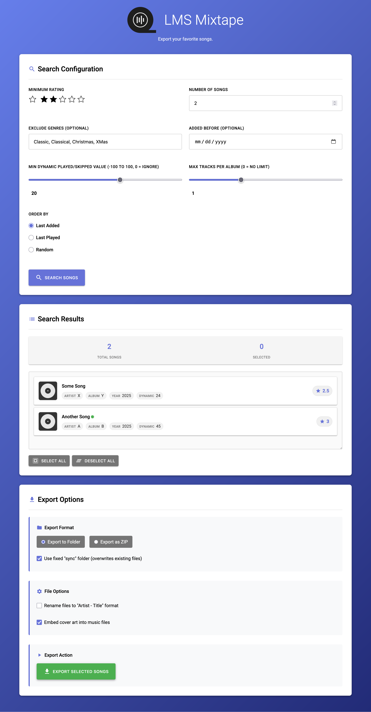

# LMS Mixtape

A modern web interface for exporting music from your library based on data from the LMS (Lyrion Music Server) database. 

The web interface allows you to:

1. Query your LMS database for songs based on rating and other criteria
2. Browse and select songs from the search results
3. Export selected songs to a folder or ZIP file
4. Download the exported ZIP file from the web interface

Like LMS, this program will not alter your library in any way. Only the exported files are changed (if selected).

## Additional features

- by default the result is deterministic and will return the songs in the order they were added
- to mix up the results the order can be set to random
- covers can be embedded after exporting to a folder if a cover can be found
- files can be renamed to a simple (artist - title) schema
- a limit of songs per album can be set
- genres can be excluded (e.g. Score, Classical, ...)
- pick a date to rediscover your favorite songs added before that day
- filter option for "dynamic played/skipped value" of the Alternative Play Count plugin
- export to folder generates a new folder for each export or exports to a folder called "sync" (e.g. for syncthing)

## Requirements

- LMS >= v9.0 (https://lyrion.org/)
- Ratings Light Plugin (https://github.com/AF-1/lms-ratingslight)
- (optional) Alternative Play Count (https://github.com/AF-1/lms-alternativeplaycount)

## Installation

LMS Mixtape can most easily be installed/deployed as a Docker container. You can find an example Docker Compose file with explanations [here](docs/docker-compose.example).

## Limitations
- LMS Mixtape is not meant to be a tool to search for specific songs/albums
- There is no security/authentication. I recommend using it locally or to with an authentication middleware (like authelia)
- Songs from cue files are ignored

## Screenshot

